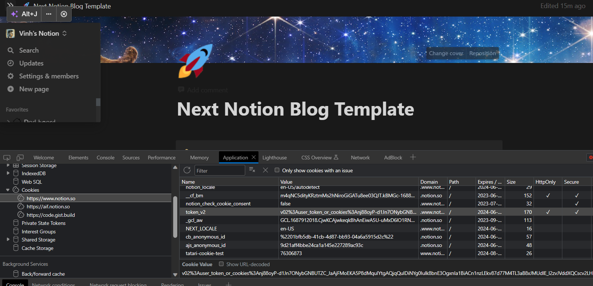
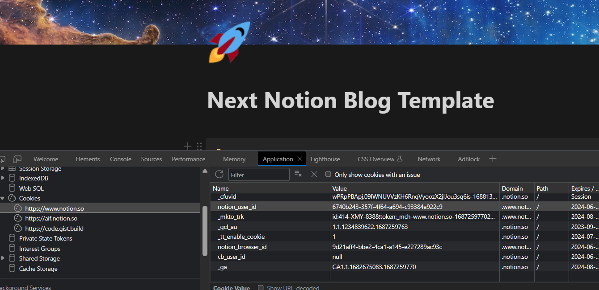

# Notion Blog RILA with Next.js 13

  

## Contents

- [Notion Blog RILA with Next.js 13](#notion-blog-rila-with-nextjs-13)
  - [Contents](#contents)
  - [🚀 Introduction](#-introduction)
  - [🌟 Features](#-features)
  - [📦 Major Package Dependencies](#-major-package-dependencies)
  - [🏁 Getting Started](#-getting-started)
    - [Environment Variables](#environment-variables)
  - [📝 TODO](#-todo)

## 🚀 Introduction

This is a blog template that uses Notion as CMS. 
Upload posts in Notion, share them through your blog! 
**This project uses `App Router` that is now stable in Next.js 13.4.**

## 🌟 Features

- Simple to sync Notion and blog
- Search posts by name
- Responsive design
- Sitemap

## 📦 Major Package Dependencies

- [react-notion-x](https://www.npmjs.com/package/react-notion-x): Renderer for notion pages

- [notionhq/client](https://www.npmjs.com/package/@notionhq/client): Import and initialize a client using an integration token or an OAuth access token.

## 🏁 Getting Started

1. Duplicate [this](https://cultured-alfalfa-a18.notion.site/Next-Notion-Blog-Template-0f9e41ed8e2e4386850a7eb59e03f6f6?pvs=25) notion blog template to your notion workspace. (Make your notion page public.)

   

2. Visit your blog page in notion with **browser**.
3. Check your database id in the url. (needed as an environment variable)

   

4. Check your auth token in the cookie. (needed as an environment variable)
   
   
5. Now you can run on local or deploy to [Vercel](https://vercel.com/dashboard) with environment variables listed [below](#environment-variables).

**Slug should be unique because it's used as url of the post page**

### Environment Variables

1. Follow the steps in the NotionAPI Docs to create an integration:
   - give the integration read-only permissions;
   - share each database you need with that integration (Add connections);
   - `NOTION_API_INTEGRATION_SECRET` add the Notion integration secret to your .env.local file.
2. `NOTION_BLOG_DB_ID` Copy the database ids and add them into your .env.local file (NOTION_BLOG_DB_ID).
3. Open notion in the web and open the network tab when signed in. Check request cookie:
   - `NOTION_TOKEN_V2` copy token_v2 into your .env.local file;
   - `NOTION_ACTIVE_USER` copy notion_user_id into your .env.local file.
     `SITE_URL`: URL of your site

## 📝 TODO
